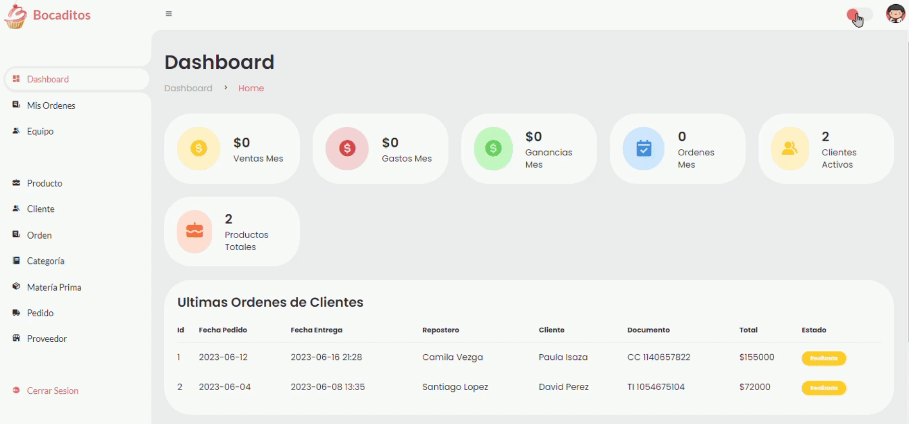
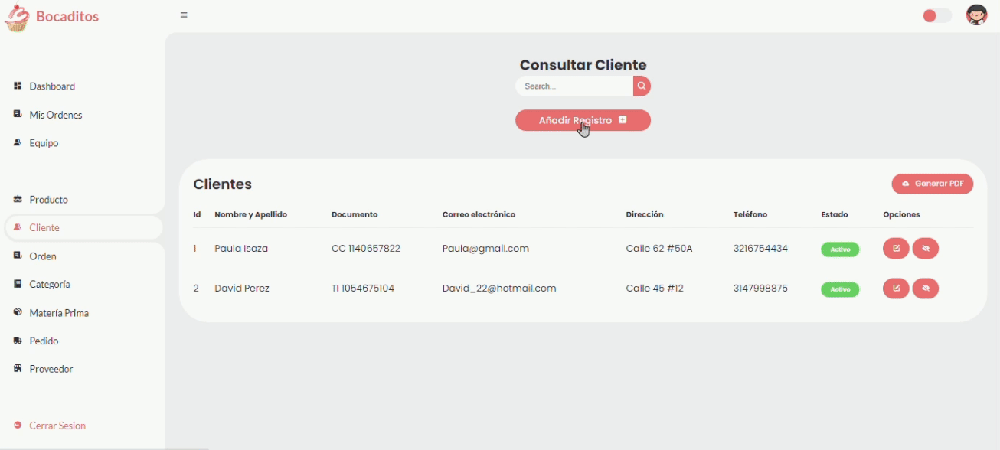
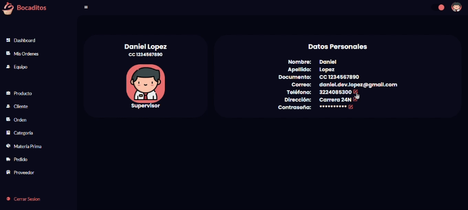
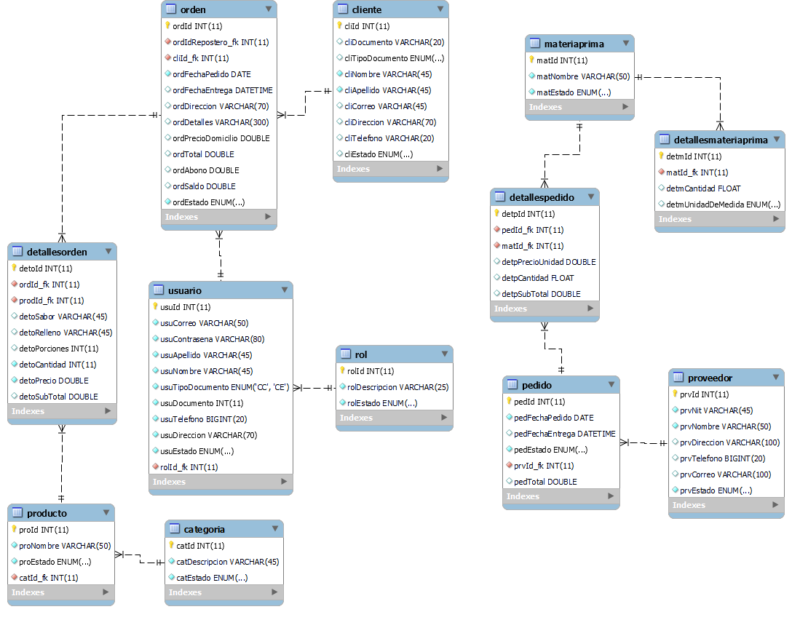

# Sistema de Gestión para Repostería Bocaditos
Este proyecto es un sistema integral desarrollado siguiendo el patrón Modelo-Vista-Controlador (MVC) para la gestión de inventario, finanzas, clientes y proveedores de la reconocida repostería Bocaditos. Utilizando Java Web (JSP), HTML, CSS, JavaScript, JasperReports y MySQL, este sistema ofrece capacidades de CRUD para mantener un control preciso sobre los activos, transacciones financieras y relaciones comerciales de la empresa.

## Características Destacadas
- Gestión de Inventario: Registra y administra los productos disponibles en el inventario, incluyendo detalles como nombre, cantidad, precio y categoría.
- Gestión Financiera: Permite realizar seguimiento y registro de las transacciones financieras, como ventas, gastos y ganancias.
- Gestión de Clientes: Almacena información detallada de los clientes, facilitando un servicio personalizado y seguimiento de compras.
- Gestión de Proveedores: Mantiene un registro actualizado de los proveedores de materias primas y servicios, facilitando la gestión de relaciones comerciales.

## Tecnologías Utilizadas
- Java Web (JSP): Para la lógica de negocio y la generación dinámica de páginas web.
- HTML y CSS: Para la estructura y el diseño visual de la interfaz de usuario.
- JavaScript: Para mejorar la interactividad y la experiencia del usuario en el navegador.
- JasperReports: Para la generación de informes y reportes personalizados.
- MySQL: Base de datos relacional utilizada para almacenar y recuperar datos.

## Vistas
> Login

> Dashboard

> Uso del modulo

> Actualización de datos

> Diagrama Entidad-Relacion

